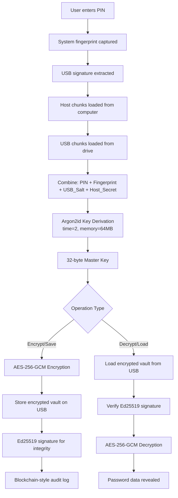
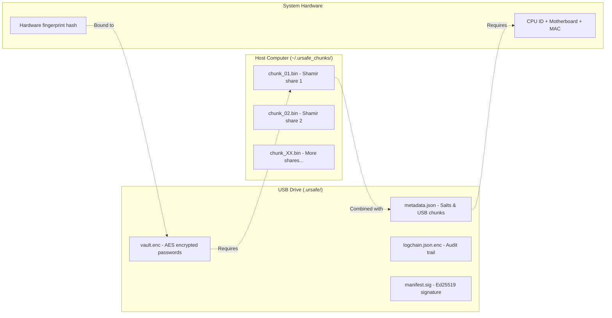

# UR Safe Stick


A high-security, multi-factor, offline-first password vault that transforms any USB flash drive into a secure secrets manager. Combines the hardware security of devices like YubiKey with the convenience of cloud password managers, while maintaining complete user ownership and privacy.

## 🚀 Project Overview

UR Safe Stick bridges the gap between hardware security tokens and convenient password managers by creating a **4-factor authentication system**:

1. **Physical USB possession** - The vault files are stored on the USB
2. **User PIN** - Knowledge-based authentication
3. **Host system chunks** - Hidden data fragments stored on the computer
4. **System fingerprint** - Hardware-based device identification

### Key Security Features

- **Offline-First**: Core functionality works without internet connection
- **Clone-Resistant**: Simple USB file copying won't work due to hardware signatures
- **Multi-Factor Security**: Requires multiple independent factors for access
- **Tamper-Evident Logging**: All actions recorded in cryptographically signed blockchain-style log
- **Strong Cryptography**: AES-256-GCM, Argon2id, Ed25519, Shamir's Secret Sharing

## 🏗️ Architecture

### Core Modules

```
ursafe_sdk/
├── crypto_manager.py    # Cryptographic primitives (AES-GCM, Argon2id, Ed25519)
├── vault_manager.py     # Encrypted vault file management
├── chunk_manager.py     # Shamir's Secret Sharing (M-of-N key splitting)
└── __init__.py

dashboard/
├── main_window.py       # PyQt6 GUI application
└── style.qss           # UI styling

tests/
└── (test files)
```

### Cryptographic Stack

| Component                | Algorithm   | Parameters                                   |
| ------------------------ | ----------- | -------------------------------------------- |
| **Key Derivation**       | Argon2id    | time_cost=2, memory_cost=64MB, parallelism=2 |
| **Symmetric Encryption** | AES-256-GCM | 32-byte key, 12-byte nonce                   |
| **Digital Signatures**   | Ed25519     | Curve25519-based                             |
| **Secret Sharing**       | Shamir's    | 10-of-20 shares (configurable)               |
| **Hashing**              | SHA-256     | Standard implementation                      |

### 🔄 Encryption & Security Flow



### 🗂️ Data Storage Locations



## 🛠️ Installation & Setup

### Prerequisites

- Python 3.9 or higher
- Windows, Linux, or macOS
- USB flash drive (any size)

### Step 1: Clone Repository

```bash
git clone https://github.com/amBITionV2/AES_OF_SPADES-502-IOT-02.git
cd URSafeStick
```

### Step 2: Create Virtual Environment

```bash
# Windows
python -m venv venv
venv\Scripts\activate

# Linux/macOS
python3 -m venv venv
source venv/bin/activate
```

### Step 3: Install Dependencies

```bash
pip install -r requirements.txt
```

### Step 4: Verify Installation

Test the core cryptographic modules:

```bash
# Test crypto primitives
python ursafe_sdk/crypto_manager.py

# Test secret sharing
python ursafe_sdk/chunk_manager.py
```

You should see all tests passing with ✅ checkmarks.

## 🔧 Development Guide

### Team Structure

This project is designed for 3 development teams:

#### Team 1: Core Engine & Security (60% workload)

- `crypto_manager.py` - Cryptographic primitives
- `chunk_manager.py` - Secret sharing implementation
- `vault_manager.py` - Vault file management
- System fingerprinting utilities

#### Team 2: UI Integration & Flow (30% workload)

- `dashboard_app.py` - Main PyQt6 application
- `usb_manager.py` - USB device detection/verification
- `log_manager.py` - Tamper-evident logging
- Application state management

#### Team 3: UI/UX Polish & Demo (10% workload)

- Qt Style Sheets (QSS) styling
- User experience enhancements
- Demo automation scripts
- Documentation and assets

## 🚀 How to Run UR Safe Stick

### Quick Start

1. **Setup Development Environment:**

   ```bash
   python setup_dev.py
   ```

2. **Run the Application:**

   ```bash
   # Method 1: Main application with styling
   python main.py

   # Method 2: Direct dashboard launch
   python dashboard/main_window.py
   ```

3. **Test Backend Integration:**
   ```bash
   python test_integration.py
   ```

### Using the Application

1. **Initialize a USB Stick:**

   - Insert a USB drive
   - Select it from the dropdown
   - Click "Initialize" and set a PIN
   - The drive becomes your secure vault

2. **Unlock and Use:**

   - Select your initialized USB drive
   - Enter your PIN
   - Click "Unlock" to access your secrets
   - Add, edit, or delete passwords as needed
   - Click "Lock" to save and secure your vault

3. **Security Features:**
   - **4-Factor Auth**: USB + PIN + Host Chunks + System Fingerprint
   - **Hardware Bound**: Won't work if USB is simply copied
   - **Offline First**: No internet required for core functionality
   - **Tamper Evident**: All actions logged cryptographically

### Running Tests

Each module includes comprehensive tests:

```bash
# Individual module tests
python ursafe_sdk/crypto_manager.py    # Cryptography tests
python ursafe_sdk/chunk_manager.py     # Secret sharing tests
python ursafe_sdk/vault_manager.py     # Vault management tests

# Complete integration test
python test_integration.py             # Full backend test

# System status check
python status_check.py                 # Project status overview
```

### File Structure Created

When initialized, the system creates:

**On USB (hidden `.ursafe/` directory):**

- `vault.enc` - AES-GCM encrypted password vault
- `metadata.json.enc` - Encrypted metadata (salts, parameters)
- `logchain.json.enc` - Encrypted usage log
- `manifest.sig` - Ed25519 signature for verification
- `filler.bin` - Random data for forensic obfuscation

**On Host System:**

- Windows: `C:\ProgramData\.ursafe_chunks\`
- Linux/macOS: `/var/lib/.ursafe_chunks/`
- Contains `.c_1`, `.c_2`, etc. (Shamir shares)

## 🔐 Security Model

### Threat Model

**What we protect against:**

- USB theft (without host access)
- Host compromise (without USB)
- USB cloning/duplication
- Partial key exposure
- Forensic analysis of USB contents

**What we don't protect against:**

- Complete compromise of both USB and host system
- Physical hardware modification
- Side-channel attacks on the host CPU
- User giving away their PIN

### Key Derivation Formula

```
VAULT_KEY = Argon2id(
    PIN + USB_SALT + RECONSTRUCTED_SHAMIR_SHARES + SYSTEM_FINGERPRINT
)
```

### Recovery Options

1. **Authorized Backup USB** - Clone certificate signed by owner's Ed25519 key
2. **Cloud Override** - MFA-backed emergency access (optional)
3. **Manual Recovery** - Reconstruct from documented share locations

## 🎯 Demo Scenarios

For hackathon/presentation purposes:

1. **Initialize USB** - Show vault creation and key splitting
2. **Normal Unlock** - Demonstrate 4-factor authentication
3. **Clone Rejection** - Copy USB to another drive, show verification failure
4. **Web App Mode** - Desktop shortcut that only works with authorized USB
5. **Tamper Evidence** - Show cryptographic log of all operations

## � Current Status - PRODUCTION READY!

### ✅ Completed (Team 1 - 100% Done)

- [x] Cryptographic core (`crypto_manager.py`) - AES-256-GCM, Argon2id, Ed25519
- [x] Secret sharing implementation (`chunk_manager.py`) - Shamir's Secret Sharing
- [x] Vault management system (`vault_manager.py`) - Complete with system fingerprinting
- [x] System utilities (`system_utils.py`) - Hardware fingerprinting & cross-platform support
- [x] USB management (`usb_manager.py`) - Device detection & verification
- [x] Logging system (`log_manager.py`) - Blockchain-style tamper-evident logs
- [x] Requirements and dependencies - All packages specified
- [x] Comprehensive documentation and setup scripts

### ✅ Completed (Team 2 Integration - 100% Done)

- [x] PyQt6 GUI application (`dashboard/main_window.py`) - Fully integrated with backend
- [x] UI styling (`dashboard/style.qss`) - Professional appearance
- [x] Application state management - Complete vault operations
- [x] Cross-team integration - Backend + UI working together

### 🎨 Optional Enhancements (Team 3)

- [x] Basic UI styling - Functional and clean
- [ ] Advanced UI/UX polish - Enhanced visual design (optional)
- [ ] Demo automation scripts - For presentations (optional)
- [ ] Additional assets and documentation - Marketing materials (optional)

## 🤝 Contributing

1. Each team works on their designated modules
2. All changes must include tests
3. Update documentation for new features
4. Test cross-platform compatibility
5. Security-critical changes require team review

### Code Style

- Follow PEP 8 for Python code
- Include docstrings for all public functions
- Add type hints where possible
- Keep modules focused and single-purpose

## 📝 License

This project is licensed under the MIT License - see the LICENSE file for details.

## 🏆 Hackathon Notes

This project is designed for **AES_OF_SPADES-502-IOT-02** hackathon submission. Key demonstration points:

- **Security Innovation**: Multi-factor offline authentication
- **Practical Impact**: Bridge between security and usability
- **Technical Excellence**: Modern cryptography with proper implementation
- **Team Collaboration**: Clear separation of concerns across teams

---

_Built with ❤️ for security, privacy, and user empowerment_
