# UR Safe Stick - Technical Implementation Guide

## 📋 Table of Contents

1. [📊 System Visualizations](#-system-visualizations)
2. [🏗️ Technical Architecture](#️-technical-architecture)
3. [🛠️ Technical Implementation Details](#️-technical-implementation-details)
4. [🚀 Integration Requirements](#-integration-requirements)
5. [📈 Data Models and Interfaces](#-data-models-and-interfaces)
6. [🔧 Development Environment Setup](#-development-environment-setup)
7. [🔍 Testing and Validation](#-testing-and-validation)
8. [📚 API Reference](#-api-reference)

---

## 📊 System Visualizations

### 1. Overall System Architecture


### 2. Blockchain Log Chain Structure


### 3. Shamir's Secret Sharing (M-of-N) Distribution


### 4. 4-Factor Authentication Flow

```mermaid
sequenceDiagram
    participant U as User
    participant D as Dashboard
    participant USB as USB Drive
    participant H as Host System
    participant HW as Hardware

    U->>D: Insert USB & Enter PIN
    D->>USB: Factor 1: Verify USB presence
    USB-->>D: USB validated ✓

    D->>D: Factor 2: Validate PIN
    D-->>D: PIN verified ✓

    D->>H: Factor 3: Check host chunks
    H-->>D: Host chunks found ✓

    D->>HW: Factor 4: Hardware fingerprint
    HW-->>D: Hardware ID matches ✓

    D->>D: All 4 factors verified
    D-->>U: Vault unlocked 🔓

    Note over D: Security: All 4 factors<br/>required for access
```



### 5. Vault Operations Workflow


### 6. Data Flow Architecture


### 7. Security Layers Visualization


### 8. Chunk Status Monitoring Flow

```mermaid
stateDiagram-v2
    [*] --> Scanning
    Scanning --> HostCheck: Check host chunks
    HostCheck --> USBCheck: Check USB chunks

    USBCheck --> Healthy: ≥10 chunks available
    USBCheck --> Degraded: 10-19 chunks available
    USBCheck --> Critical: <10 chunks available

    Healthy --> Monitoring: Normal operation
    Degraded --> Warning: Show warning
    Critical --> Alert: Cannot reconstruct

    Monitoring --> Scanning: Every 2-5 seconds
    Warning --> Scanning: Every 2-5 seconds
    Alert --> Scanning: Every 2-5 seconds

    note right of Healthy
        All security layers
        functioning normally
    end note

    note right of Degraded
        Some chunks missing
        but still operational
    end note

    note right of Critical
        Cannot unlock vault
        Need chunk recovery
    end note
```



---

## 🏗️ Technical Architecture

### Project Structure

```
URSafeStick/
├── main.py                    # Entry point - launches dashboard
├── dashboard/
│   ├── main_window.py        # Primary user dashboard
│   ├── log_console.py        # Log console utility
│   ├── wizard.py             # Setup wizard
│   └── style.qss            # UI styling
├── ursafe_sdk/              # Core SDK
│   ├── __init__.py          # Package initialization
│   ├── chunk_manager.py     # Shamir's Secret Sharing implementation
│   ├── crypto_manager.py    # AES-256-GCM + Argon2id + Ed25519
│   ├── vault_manager.py     # Vault operations
│   ├── usb_manager.py       # USB detection and verification
│   ├── system_utils.py      # Hardware fingerprinting
│   └── log_manager.py       # Blockchain-style logging
├── assets/                  # SVG icons (6 available)
│   ├── usb.svg
│   ├── unlock.svg
│   ├── lock-in.svg
│   ├── refresh.svg
│   ├── settings.svg
│   └── add-folder.svg
├── tests/                   # Test suite
│   ├── setup_dev.py         # Development setup
│   └── quick_verify.py      # Quick verification tests
├── requirements.txt         # Dependencies
└── blockchain_iot_analysis.py  # Technical analysis
```

### Core Components

#### Security Implementation

- **AES-256-GCM Encryption**: Military-grade symmetric encryption
- **Argon2id Key Derivation**: Memory-hard, GPU-resistant KDF
- **Ed25519 Digital Signatures**: Modern elliptic curve signatures
- **4-Factor Authentication**: USB + PIN + Host Chunks + Hardware Fingerprint

#### Distributed Storage (Shamir's Secret Sharing)

- **Configuration**: 10-of-20 shares (M-of-N threshold scheme)
- **Host Chunks**: 15 shares stored in `C:\ProgramData\.ursafe_chunks\`
- **USB Chunks**: 5 shares stored in `{USB_DRIVE}\.ursafe\chunks\`
- **Reconstruction**: Automatic collection and key recovery

#### Tamper-Evident Logging

- **Hash Chaining**: Each entry cryptographically linked to previous
- **Digital Signatures**: Ed25519 signatures on all log entries
- **Immutable Audit Trail**: Complete history of all vault operations
- **Integrity Verification**: Real-time chain validation

---

## 🛠️ Technical Implementation Details

### Core Classes and Methods

#### VaultManager (`ursafe_sdk/vault_manager.py`)

```python
class VaultManager:
    def __init__(self, usb_drive_path: str)
    def initialize_vault(self, pin: str) -> bool
    def unlock_vault(self, pin: str) -> dict
    def save_vault(self, pin: str, vault_data: dict) -> bool
    def lock_vault(self) -> bool
    def get_vault_status() -> dict
    def get_storage_info() -> dict
    def verify_vault_integrity() -> bool
```

#### ChunkManager (`ursafe_sdk/chunk_manager.py`)

```python
# Constants
DEFAULT_REQUIRED_SHARES = 10  # M value
DEFAULT_TOTAL_SHARES = 20     # N value

def split_master_key(master_key: bytes, m: int, n: int) -> list[bytes]
def reconstruct_master_key(shares: list[bytes]) -> bytes
def save_host_chunks(shares: list[bytes]) -> bool
def load_host_chunks() -> list[bytes]
def get_host_chunk_dir() -> str
def get_chunk_status() -> dict
def verify_chunk_integrity() -> bool
```

#### CryptoManager (`ursafe_sdk/crypto_manager.py`)

```python
def generate_master_key() -> bytes
def derive_key_argon2id(password: str, salt: bytes) -> bytes
def encrypt_aes_gcm(data: bytes, key: bytes) -> dict
def decrypt_aes_gcm(encrypted_data: dict, key: bytes) -> bytes
def generate_ed25519_keypair() -> tuple
def sign_data(private_key: bytes, data: bytes) -> bytes
def verify_signature(public_key: bytes, signature: bytes, data: bytes) -> bool
def hash_sha256(data: bytes) -> bytes
```

#### LogManager (`ursafe_sdk/log_manager.py`)

```python
def add_log_entry(drive_path: str, action: str, signing_key=None) -> bool
def get_log_chain(drive_path: str) -> list
def verify_log_chain(drive_path: str) -> bool
def get_previous_hash(log_file_path: str) -> str
def get_log_statistics(drive_path: str) -> dict
```

#### SystemUtils (`ursafe_sdk/system_utils.py`)

```python
def get_system_fingerprint() -> bytes
def get_hardware_info() -> dict
def get_mac_addresses() -> list
def get_cpu_info() -> dict
def get_motherboard_info() -> dict
def verify_hardware_fingerprint(stored_fingerprint: bytes) -> bool
```

#### USBManager (`ursafe_sdk/usb_manager.py`)

```python
def find_usb_drives() -> list
def verify_stick(drive_path: str) -> dict
def get_drive_info(drive_path: str) -> dict
def is_valid_ursafe_stick(drive_path: str) -> bool
def get_drive_serial(drive_path: str) -> str
```

### Data Sources for Real-time Monitoring

#### Chunk Status Monitoring

```python
# Host chunks location (Windows)
host_chunks_dir = "C:\\ProgramData\\.ursafe_chunks\\"
# Files: .c_1, .c_2, .c_3, ..., .c_20

# USB chunks location
usb_chunks_dir = "{USB_DRIVE}\\.ursafe\\chunks\\"
# Files: .c_1, .c_2, .c_3, ..., .c_20

# Monitor file existence, timestamps, and integrity
```

#### Blockchain Log Monitoring

```python
# Log file location
log_file = "{USB_DRIVE}\\.ursafe\\logchain.json"

# Each line contains one JSON log entry:
{
    "timestamp": "2025-10-04T12:34:56.789Z",
    "action": "vault_unlocked",
    "prev_hash": "abc123def456...",
    "current_hash": "def456abc123...",
    "signature": "789xyz456abc..."
}
```

#### System Fingerprint Components

```python
fingerprint_data = {
    "cpu_id": "BFEBFBFF000906EA",        # Processor ID
    "motherboard_serial": "123456789",   # MB serial number
    "mac_addresses": ["00:11:22:33:44:55"],  # Network interfaces
    "platform": "Windows-10-AMD64",     # OS and architecture
    "combined_hash": "sha256_hash_of_above"  # Final fingerprint
}
```

---

## 🚀 Integration Requirements

### Application Entry Point

```python
# main.py structure
import sys
from PyQt6.QtWidgets import QApplication
from dashboard.main_window import MainWindow

def main():
    app = QApplication(sys.argv)

    # Launch primary dashboard
    window = MainWindow()
    window.show()

    sys.exit(app.exec())

if __name__ == '__main__':
    main()
```

### Inter-Component Communication

```python
# Event-driven architecture using Qt Signals/Slots
from PyQt6.QtCore import QObject, pyqtSignal

class SystemEventBus(QObject):
    vault_status_changed = pyqtSignal(dict)
    chunk_status_changed = pyqtSignal(dict)
    log_entry_added = pyqtSignal(dict)
    usb_status_changed = pyqtSignal(dict)
    security_alert = pyqtSignal(str)
```

### Required Dependencies

```python
# Core dependencies (requirements.txt)
PyQt6==6.9.1              # GUI framework
pyshamir==1.0.0           # Shamir's Secret Sharing
cryptography==43.0.1      # Cryptographic operations
argon2-cffi==23.1.0       # Key derivation function

# Optional visualization dependencies
matplotlib==3.7.2         # Charts and graphs
plotly==5.17.0            # Interactive visualizations
networkx==3.1             # Network diagrams
```

---

## 📈 Data Models and Interfaces

### Chunk Status Data Model

```python
ChunkStatus = {
    "total_shares": 20,
    "required_shares": 10,
    "host_shares": {
        "location": "C:\\ProgramData\\.ursafe_chunks\\",
        "available": 15,
        "files": [".c_1", ".c_2", ".c_3", ..., ".c_15"],
        "last_modified": "2025-10-04T12:34:56Z",
        "integrity_verified": True
    },
    "usb_shares": {
        "location": "E:\\.ursafe\\chunks\\",
        "available": 5,
        "files": [".c_16", ".c_17", ".c_18", ".c_19", ".c_20"],
        "last_modified": "2025-10-04T12:34:56Z",
        "integrity_verified": True
    },
    "reconstruction_possible": True,
    "security_level": "optimal"  # optimal/degraded/critical
}
```

### Log Entry Data Model

```python
LogEntry = {
    "timestamp": "2025-10-04T12:34:56.789Z",
    "action": "vault_unlocked",
    "prev_hash": "abc123def456789...",
    "current_hash": "def456abc123789...",
    "signature": "ed25519_signature_hex",
    "verified": True,
    "block_number": 42,
    "data_size": 256
}

LogChain = {
    "total_entries": 42,
    "chain_valid": True,
    "genesis_hash": "genesis",
    "latest_hash": "def456abc123789...",
    "entries": [LogEntry, LogEntry, ...]
}
```

### System Information Data Model

```python
SystemInfo = {
    "pc_id": "sha256_hardware_fingerprint",
    "hardware": {
        "cpu_id": "BFEBFBFF000906EA",
        "motherboard_serial": "123456789",
        "mac_addresses": ["00:11:22:33:44:55", "aa:bb:cc:dd:ee:ff"],
        "platform": "Windows-10-AMD64",
        "architecture": "x86_64"
    },
    "fingerprint_components": {
        "cpu_weight": 0.3,
        "motherboard_weight": 0.3,
        "mac_weight": 0.2,
        "platform_weight": 0.2
    },
    "stability_score": 0.95,
    "last_verified": "2025-10-04T12:34:56Z"
}
```

### USB Information Data Model

```python
USBInfo = {
    "drive_path": "E:\\",
    "serial_number": "AA12345678901234",
    "vendor": "SanDisk",
    "model": "Ultra USB 3.0",
    "capacity": {
        "total_bytes": 32000000000,
        "free_bytes": 31000000000,
        "used_bytes": 1000000000
    },
    "file_system": "FAT32",
    "vault_info": {
        "present": True,
        "path": "E:\\.ursafe\\",
        "size_bytes": 2048,
        "encrypted": True,
        "last_accessed": "2025-10-04T12:34:56Z"
    },
    "chunks_info": {
        "directory": "E:\\.ursafe\\chunks\\",
        "count": 5,
        "total_size": 512
    }
}
```

### Vault Status Data Model

```python
VaultStatus = {
    "unlocked": True,
    "drive_path": "E:\\",
    "encryption": {
        "algorithm": "AES-256-GCM",
        "key_derivation": "Argon2id",
        "signature_scheme": "Ed25519"
    },
    "authentication": {
        "factors_verified": 4,
        "factors_required": 4,
        "last_unlock": "2025-10-04T12:34:56Z",
        "session_duration": 3600
    },
    "secrets": {
        "count": 15,
        "last_modified": "2025-10-04T12:30:00Z"
    },
    "security_metrics": {
        "integrity_verified": True,
        "tamper_detected": False,
        "risk_level": "low"
    }
}
```

---

## 🔧 Development Environment Setup

### Prerequisites

```bash
# Python 3.11+ required
python --version  # Should be 3.11 or higher

# Virtual environment (recommended)
python -m venv venv
# Windows
venv\Scripts\activate
# Linux/macOS
source venv/bin/activate
```

### Installation Steps

```bash
# Clone repository
git clone https://github.com/amBITionV2/AES_OF_SPADES-502-IOT-02.git
cd AES_OF_SPADES-502-IOT-02/debug/URSafeStick

# Install dependencies
pip install -r requirements.txt

# Development dependencies (optional)
pip install pytest black isort mypy flake8

# Run application
python main.py
```

### Project Configuration

```python
# Configuration constants (in respective modules)

# Chunk Manager Configuration
DEFAULT_REQUIRED_SHARES = 10  # M value
DEFAULT_TOTAL_SHARES = 20     # N value

# Crypto Manager Configuration
AES_KEY_SIZE = 32            # 256-bit keys
ARGON2_TIME_COST = 3         # Time parameter
ARGON2_MEMORY_COST = 65536   # Memory parameter (64MB)
ARGON2_PARALLELISM = 1       # Threads

# System Configuration
HOST_CHUNK_DIR_WINDOWS = r"C:\ProgramData\.ursafe_chunks"
HOST_CHUNK_DIR_UNIX = "/var/lib/.ursafe_chunks"
URSAFE_DIR = ".ursafe"
LOG_FILENAME = "logchain.json"
```

### Development Tools

```bash
# Code formatting
black ursafe_sdk/ dashboard/ tests/

# Import sorting
isort ursafe_sdk/ dashboard/ tests/

# Type checking
mypy ursafe_sdk/

# Linting
flake8 ursafe_sdk/ dashboard/

# Testing
pytest tests/ -v
```

---

## 🔍 Testing and Validation

### Test Categories

#### Unit Tests

```python
# Test individual components
pytest tests/test_crypto_manager.py
pytest tests/test_chunk_manager.py
pytest tests/test_vault_manager.py
pytest tests/test_log_manager.py
pytest tests/test_system_utils.py
pytest tests/test_usb_manager.py
```

#### Integration Tests

```python
# Test component interactions
pytest tests/test_vault_operations.py
pytest tests/test_4factor_auth.py
pytest tests/test_chunk_distribution.py
pytest tests/test_log_chain_integrity.py
```

#### Security Tests

```python
# Security validation
pytest tests/test_encryption_strength.py
pytest tests/test_key_derivation.py
pytest tests/test_signature_verification.py
pytest tests/test_tamper_detection.py
```

### Test Scenarios

#### Chunk Management Testing

```python
def test_chunk_distribution():
    # Test M-of-N share generation
    # Verify chunk storage locations
    # Test key reconstruction
    # Validate integrity checks

def test_chunk_recovery():
    # Test with missing chunks
    # Verify reconstruction limits
    # Test degraded scenarios
```

#### Blockchain Log Testing

```python
def test_log_chain_integrity():
    # Verify hash chaining
    # Test signature validation
    # Check tamper detection
    # Validate log ordering

def test_log_performance():
    # Test with large log files
    # Verify parsing speed
    # Check memory usage
```

#### Security Testing

```python
def test_4factor_authentication():
    # Test each factor individually
    # Test factor combinations
    # Verify failure scenarios

def test_hardware_fingerprinting():
    # Test fingerprint stability
    # Verify hardware changes
    # Test cross-platform compatibility
```

### Data Validation

#### Chunk Validation

```python
def validate_chunk_counts():
    assert host_chunks + usb_chunks == TOTAL_SHARES
    assert available_chunks >= REQUIRED_SHARES
    assert chunk_integrity_verified == True

def validate_reconstruction():
    shares = collect_available_shares()
    assert len(shares) >= REQUIRED_SHARES
    master_key = reconstruct_master_key(shares)
    assert len(master_key) == 32  # 256-bit key
```

#### Log Chain Validation

```python
def validate_log_chain():
    entries = load_log_chain()
    for i, entry in enumerate(entries[1:], 1):
        prev_hash = calculate_hash(entries[i-1])
        assert entry['prev_hash'] == prev_hash
        assert verify_signature(entry) == True
```

#### System Validation

```python
def validate_system_fingerprint():
    current_fp = get_system_fingerprint()
    stored_fp = load_stored_fingerprint()
    similarity = calculate_similarity(current_fp, stored_fp)
    assert similarity >= FINGERPRINT_THRESHOLD
```

---

## 📚 API Reference

### VaultManager API

```python
class VaultManager:
    """Main vault operations manager"""

    def __init__(self, usb_drive_path: str):
        """Initialize vault manager for specific USB drive"""

    def initialize_vault(self, pin: str) -> bool:
        """Create new vault with PIN protection"""

    def unlock_vault(self, pin: str) -> dict:
        """Unlock vault and return decrypted data"""

    def save_vault(self, pin: str, vault_data: dict) -> bool:
        """Encrypt and save vault data"""

    def get_vault_status(self) -> dict:
        """Get current vault status information"""

    def verify_integrity(self) -> bool:
        """Verify vault data integrity"""
```

### ChunkManager API

```python
def split_master_key(master_key: bytes, m: int = 10, n: int = 20) -> list[bytes]:
    """Split master key using Shamir's Secret Sharing"""

def reconstruct_master_key(shares: list[bytes]) -> bytes:
    """Reconstruct master key from available shares"""

def save_host_chunks(shares: list[bytes]) -> bool:
    """Save chunk shares to host system"""

def load_host_chunks() -> list[bytes]:
    """Load available chunks from host system"""

def get_chunk_status() -> dict:
    """Get status of all chunk shares"""

def get_host_chunk_dir() -> str:
    """Get host chunk directory path"""
```

### CryptoManager API

```python
def generate_master_key() -> bytes:
    """Generate cryptographically secure 256-bit key"""

def derive_key_argon2id(password: str, salt: bytes,
                       time_cost: int = 3, memory_cost: int = 65536) -> bytes:
    """Derive key using Argon2id KDF"""

def encrypt_aes_gcm(data: bytes, key: bytes) -> dict:
    """Encrypt data using AES-256-GCM"""

def decrypt_aes_gcm(encrypted_data: dict, key: bytes) -> bytes:
    """Decrypt AES-256-GCM encrypted data"""

def sign_data(private_key: bytes, data: bytes) -> bytes:
    """Create Ed25519 signature"""

def verify_signature(public_key: bytes, signature: bytes, data: bytes) -> bool:
    """Verify Ed25519 signature"""
```

### LogManager API

```python
def add_log_entry(drive_path: str, action: str, signing_key=None) -> bool:
    """Add new entry to blockchain log"""

def get_log_chain(drive_path: str) -> list:
    """Retrieve complete log chain"""

def verify_log_chain(drive_path: str) -> bool:
    """Verify log chain integrity"""

def get_log_statistics(drive_path: str) -> dict:
    """Get log chain statistics"""

def get_recent_logs(drive_path: str, count: int = 10) -> list:
    """Get most recent log entries"""
```

### SystemUtils API

```python
def get_system_fingerprint() -> bytes:
    """Generate stable hardware fingerprint"""

def get_hardware_info() -> dict:
    """Get detailed hardware information"""

def get_mac_addresses() -> list:
    """Get all network interface MAC addresses"""

def verify_hardware_fingerprint(stored_fingerprint: bytes) -> bool:
    """Verify current hardware against stored fingerprint"""

def get_security_metrics() -> dict:
    """Get system security metrics"""
```

### USBManager API

```python
def find_usb_drives() -> list:
    """Find all connected USB drives"""

def verify_stick(drive_path: str) -> dict:
    """Verify if drive is valid UR Safe Stick"""

def get_drive_info(drive_path: str) -> dict:
    """Get detailed drive information"""

def is_valid_ursafe_stick(drive_path: str) -> bool:
    """Check if drive contains valid UR Safe vault"""

def get_drive_serial(drive_path: str) -> str:
    """Get drive serial number"""
```

---

_This technical guide provides comprehensive implementation details for the UR Safe Stick system. Use this as reference for understanding the architecture, APIs, and development processes._

**Status**: Complete Technical Implementation ✅
